# Data Flow Analysis

## Asset Inventory

### Entry Points

| Kind | Framework | Method | Path / Name | Location |
|------|-----------|--------|-------------|----------|
| cli_command | cobra | — | `verify-network` | `internal/cmd/verifynetwork/verifynetwork.go:26` |
| cli_command | cobra | — | `cache` | `internal/cmd/cache/cache.go:13` |
| cli_command | cobra | — | `init` | `internal/cmd/cache/init/init.go:26` |
| cli_command | cobra | — | `delete` | `internal/cmd/cache/delete/delete.go:26` |
| cli_command | cobra | — | `verify-mergeable` | `internal/cmd/verifymergeable/verifymergeable.go:60` |
| cli_command | cobra | — | `tui` | `internal/cmd/tui/tui.go:51` |
| cli_command | cobra | — | `attest` | `internal/cmd/attest/attest.go:16` |
| cli_command | cobra | — | `apply` | `internal/cmd/attest/apply/apply.go:40` |
| cli_command | cobra | — | `github` | `internal/cmd/attest/github/github.go:15` |
| cli_command | cobra | — | `pull-request` | `internal/cmd/attest/github/pullrequest/pullrequest.go:99` |
| cli_command | cobra | — | `record-approval` | `internal/cmd/attest/github/recordapproval/recordapproval.go:92` |
| cli_command | cobra | — | `dismiss-approval` | `internal/cmd/attest/github/dismissapproval/dismissapproval.go:66` |
| cli_command | cobra | — | `authorize` | `internal/cmd/attest/authorize/authorize.go:69` |
| cli_command | cobra | — | `clone` | `internal/cmd/clone/clone.go:65` |
| cli_command | cobra | — | `version` | `internal/cmd/version/version.go:34` |
| cli_command | cobra | — | `gittuf` | `internal/cmd/root/root.go:104` |
| cli_command | cobra | — | `dev` | `internal/cmd/dev/dev.go:18` |
| cli_command | cobra | — | `New()` | `internal/cmd/dev/dismissgithubapproval/dismissgithubapproval.go:27` |
| cli_command | cobra | — | `New()` | `internal/cmd/dev/attestgithub/attestgithub.go:27` |
| cli_command | cobra | — | `New()` | `internal/cmd/dev/addgithubapproval/addgithubapproval.go:27` |
| cli_command | cobra | — | `rsl-record` | `internal/cmd/dev/rslrecordat/rslrecordat.go:65` |
| cli_command | cobra | — | `verify-ref` | `internal/cmd/verifyref/verifyref.go:69` |
| cli_command | cobra | — | `trust` | `internal/cmd/trust/trust.go:46` |
| cli_command | cobra | — | `set-repository-location` | `internal/cmd/trust/setrepositorylocation/setrepositorylocation.go:48` |
| cli_command | cobra | — | `add-network-repository` | `internal/cmd/trust/addnetworkrepository/addnetworkrepository.go:77` |
| cli_command | cobra | — | `init` | `internal/cmd/trust/init/init.go:47` |
| cli_command | cobra | — | `remove-hook` | `internal/cmd/trust/removehook/removehook.go:84` |
| cli_command | cobra | — | `enable-github-app-approvals` | `internal/cmd/trust/enablegithubappapprovals/enablegithubappapprovals.go:48` |
| cli_command | cobra | — | `update-policy-threshold` | `internal/cmd/trust/updatepolicythreshold/updatepolicythreshold.go:48` |
| cli_command | cobra | — | `make-controller` | `internal/cmd/trust/makecontroller/makecontroller.go:40` |
| … | | | | *58 more entries not shown* |

### Data Stores

No data stores detected.

### Authentication Mechanisms

⚠️ No authentication decorators identified by the structural pipeline. This does NOT mean the application is unauthenticated — it means no recognized decorator pattern was found. Review the entry points above manually.

## Data Flow Diagram

```mermaid
flowchart LR
    User(["External Actor"])
    EP0["verify-network"]
    EP1["cache"]
    EP2["init"]
    EP3["delete"]
    EP4["verify-mergeable"]
    EP5["tui"]
    EP6["attest"]
    EP7["apply"]
    EP8["github"]
    EP9["pull-request"]
    EP10["record-approval"]
    EP11["dismiss-approval"]
    EP12["authorize"]
    EP13["clone"]
    EP14["version"]
    EP15["gittuf"]
    EP16["dev"]
    EP17["New()"]
    EP18["New()"]
    EP19["New()"]
    EP20["rsl-record"]
    EP21["verify-ref"]
    EP22["trust"]
    EP23["set-repository-location"]
    EP24["add-network-repository"]
    EP25["init"]
    EP26["remove-hook"]
    EP27["enable-github-app-approvals"]
    EP28["update-policy-threshold"]
    EP29["make-controller"]
    EP30["remove-policy-key"]
    EP31["list-propagation-directives"]
    EP32["add-policy-key"]
    EP33["increment-version"]
    EP34["add-root-key"]
    EP35["remove-root-key"]
    EP36["remove-global-rule"]
    EP37["remove-propagation-directive"]
    EP38["update-root-threshold"]
    EP39["update-global-rule"]
    EP40["inspect-root"]
    EP41["add-github-app"]
    EP42["update-hook"]
    EP43["add-controller-repository"]
    EP44["add-hook"]
    EP45["remove-github-app"]
    EP46["list-global-rules"]
    EP47["add-global-rule"]
    EP48["list-hooks"]
    EP49["sign"]
    User --> EP0
    User --> EP1
    User --> EP2
    User --> EP3
    User --> EP4
    User --> EP5
    User --> EP6
    User --> EP7
    User --> EP8
    User --> EP9
    User --> EP10
    User --> EP11
    User --> EP12
    User --> EP13
    User --> EP14
    User --> EP15
    User --> EP16
    User --> EP17
    User --> EP18
    User --> EP19
    User --> EP20
    User --> EP21
    User --> EP22
    User --> EP23
    User --> EP24
    User --> EP25
    User --> EP26
    User --> EP27
    User --> EP28
    User --> EP29
    User --> EP30
    User --> EP31
    User --> EP32
    User --> EP33
    User --> EP34
    User --> EP35
    User --> EP36
    User --> EP37
    User --> EP38
    User --> EP39
    User --> EP40
    User --> EP41
    User --> EP42
    User --> EP43
    User --> EP44
    User --> EP45
    User --> EP46
    User --> EP47
    User --> EP48
    User --> EP49
```

*DFD simplified: only the top 50 nodes are shown (total asset count: 88).*

## Attack Chains

No compound attack paths identified.

